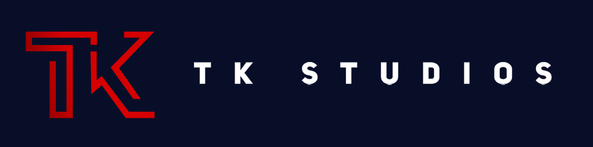

<title>Test</title>

# About Us

## Introduction

> TK Studios is a small team of 4 members working together to create highly customisable resources for FiveM & RedM

## Community

> We make some of our resources open source and encourage contributions from those to want to help improve our resources. If you want to contribute to a project please make a fork and then make a pull request with your changes clearly outlined.

> We have a discord server that you can join using the link below

<a class="btn" name="button" target="_blank" href="https://discord.gg/5FVCrX4PVW">Join Our Discord</a>

## Members

### TK ( Tom Kirkman-Wood )

> TK is a web developer and technician based in the UK. He is the founder of TK Studios and has been developing for FiveM for the last 4-5 years.

<a class="btn" name="button" target="_blank" href="https://site.tkw.bz">Website</a>

### Ethan

> Description Not Available

### NuK3

> NuK3 is a vehicle, model, map, and texture developer based in the US. He has been developing for GTA V for 6-7 years, with more than 3 years being for FiveM

### Nathan H

> Description Not Available

## Partners

### San Andreas Roleplay

> San Andreas Roleplay is a growing QBCore community with over 17,000 members! They boast a range of active departments and custom resources, mlos and an active staff and support team.

<a class="btn" name="button" target="_blank" href="https://discord.gg/sarp">SARP Discord</a>
