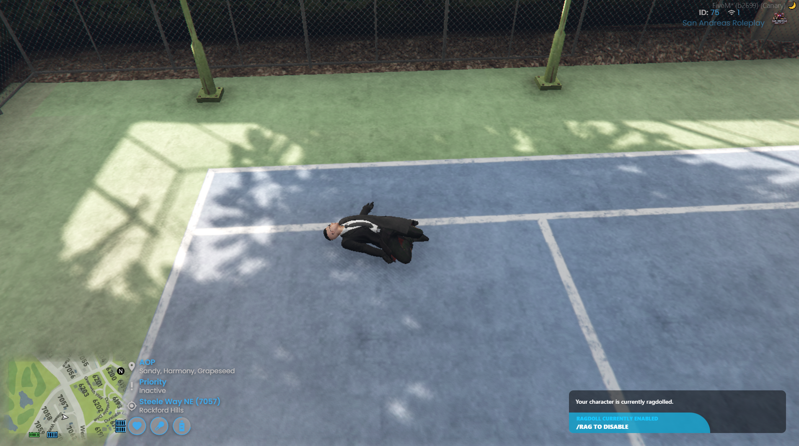

[Back To Home](/)

# tk-ragdoll

> You can enable debugging for TK Studios resources by enabling the `Config.Debug` option in `tk-lib`.



> TK Ragdoll is a free resource made by TK Studios

## Install

### 1. Dependencies

TK Ragdoll has 1 dependency:

- tk-lib (Available from keymaster)

### 2. Starting resources

Ensure that `tk-lib` is in your resource folder. We reccommend putting all TK Studios resources in a folder called `[tk-studios]`.

Add `ensure [tk-studios]` to your server.cfg

Reboot your server

## Config

> There are no configurable options for this resource

## Client Exports

### SetRagdoll()

```js
global.exports["tk-ragdoll"].SetRagdoll(true); // Enable Ragdoll

global.exports["tk-ragdoll"].SetRagdoll(false); // Disable Ragdoll
```
